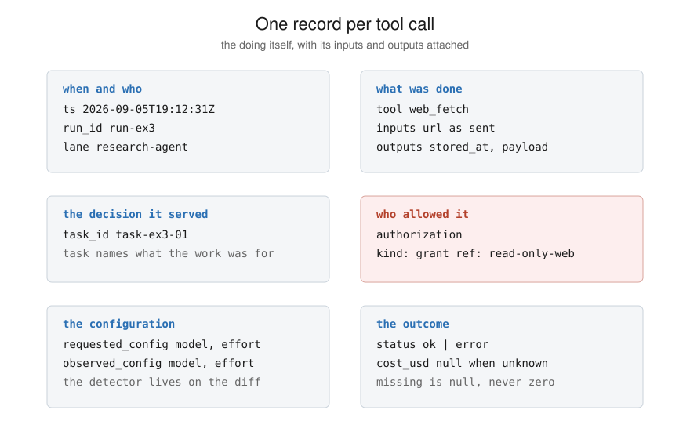

# 1. Log every tool call

A model's reasoning text is the model's account of what it was doing.
A tool call is the doing itself, with its inputs and outputs attached,
and it happens on infrastructure you can instrument. When the account
degrades, the actions are still visible on your side. That is why the
log is the first thing to own.

## The record

One record per call. The fields, and why each earns its place:

- `ts`, `run_id`, `lane`: when it happened, which run, which worker.
  Without these, a week of calls is one undifferentiated pile.
- `tool`, `inputs`, `outputs`: what was done. Store payloads when they
  are small and pointers (`stored_at`) when they are big. The pointer
  is what makes example 1's quote check possible.
- `task_id`: the decision the call served. This is the field that
  turns a log into an audit trail. "Name the call that wrote to the
  database twice yesterday" is answerable only because calls hang off
  tasks and tasks hang off decisions.
- `authorization`: who allowed it. An `approval` names the person who
  signed off on this exact action. A `grant` names a standing rule.
  If a call can spend money, send a message, or change stored state,
  this field is not optional.
- `requested_config` / `observed_config`: what you asked for and what
  ran. The downgrade detector lives on the difference. See doc 4.
- `status`, `cost_usd`: ok or error, and the money. Unknown cost is
  null, never zero.

## The rules that make the log auditable

- Append-only. Never edit a landed record.
- A mistake is fixed by a `correction` record that points at the
  original. Readers apply corrections in order and can reconstruct
  what was believed at any point in time.
- Missing values are null. Zero is a measurement; null is an honest
  gap.
- The first line of the file is a `schema` record, so the raw file
  explains itself.

## Where to log from

Wrap the point where your agent runtime dispatches a tool, not the
individual tools. One wrapper covers every present and future tool;
per-tool logging drifts out of date the first time you add one. If
your framework emits tool-call events already, the wrapper is a
translator from its event shape to the record shape. If it does not,
the wrapper is a function the agent calls instead of calling tools
directly.

Log the call even when it fails. `status: error` with the error in
`outputs` is some of the most useful material in the file.

## What it costs

One JSON line per call. At a thousand calls a day that is a file you
can still open in an editor. When it stops being one, the records
move to a database unchanged; the schema does not care where the
lines live. See `05-adapting-to-your-stack.md`.
