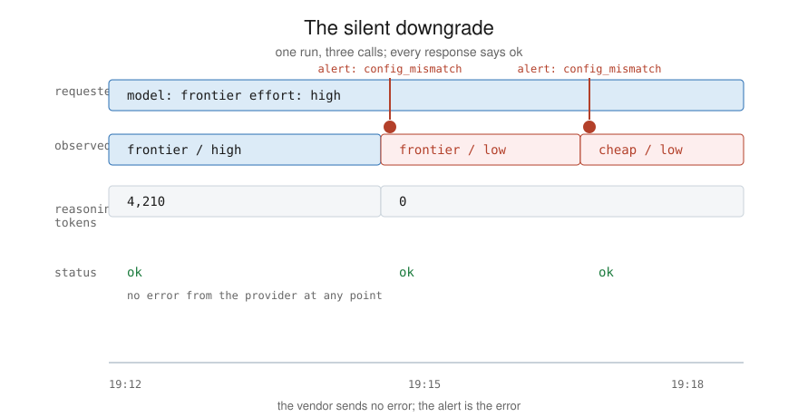

# 4. Detect silent downgrades

A downgrade is quiet by construction. When a stack switches a run to a
cheaper model or a lower effort setting mid-task, the provider returns
ok, the output keeps arriving, and the reasoning text disappears with
no error attached. You find out from the output, after it surprises
you, unless something on your side is checking.

## The check

`src/downgrade.py` compares `requested_config` against
`observed_config` on every tool call, field by field. Any difference
is a mismatch, and with `--write` each mismatch appends an `alert`
record to the ledger:

```json
{"record_type": "alert", "kind": "config_mismatch", "run_id": "run-ex3",
 "detail": [{"field": "effort", "requested": "high", "observed": "low"}]}
```



The check is only as good as the two config fields:

- `requested_config` comes from your budget resolution (doc 3). You
  already have it.
- `observed_config` comes from the provider's response metadata where
  the provider exposes it, and from your router's own records where
  the routing happens in your stack. Fields you cannot observe stay
  null, and the detector skips nulls rather than guessing. That makes
  unobservable fields a known blind spot. Write down which fields are
  blind for your stack; a blind spot you have named is a different
  thing from one you have not.

## Where the alert goes

The kit appends alerts to the ledger so they join the same audit
trail as everything else. What happens next is yours: a cron job that
pages on new alert records, a CI step that fails on them, a line in
the daily review. The alert existing in one durable place is what
matters. Alert routing is the easy part to change later.

## What this does not catch

A provider can change a model's behavior without changing its name.
Config comparison cannot see that. What it does is give you a clean
baseline of what ran, per call, so when behavior shifts you can line
the shift up against the record and ask the vendor a specific
question. Version pins and dated model identifiers in
`requested_config` make that question sharper.
