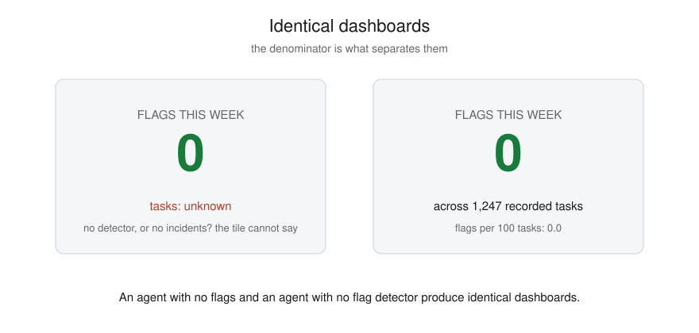

# Example 4: identical dashboards

The launch-week failure, in one line from Gabriel Anhaia's piece:
"An agent with no flags and an agent with no flag detector produce
identical dashboards." A vendor's headline safety claim was a flag
count taken on the vendor's own runs. A customer has no flag count
and no task count for their own agents.

Both ledgers here would render the same dashboard tile: zero flags.
Only one of them earned the zero.

- `ledger-tasks.jsonl`: six tasks across three classes, no flags. The
  zero has a denominator.
- `ledger-empty.jsonl`: no tasks recorded at all. Nothing ran, or
  nothing was logged, and the dashboard cannot tell the difference.

Run it:

```bash
python3 ../../src/flags.py ledger-tasks.jsonl
python3 ../../src/flags.py ledger-empty.jsonl   # exits 1 and says why
```



What to take from it:

- Define the count before you need it: flags per agent, per day, per
  task class. `src/flags.py` refuses to print a bare zero; keep that
  refusal when you adapt it.
- The denominator comes from task records, not from the flag table.
  If your agents do not write task records, that is the first gap to
  close.
- The same argument applies to any safety number someone hands you.
  Ask for the denominator, and ask who counted.
